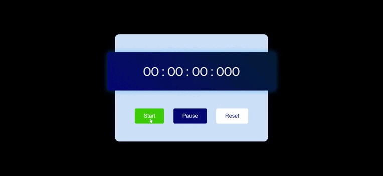

<h1 align="center"> :desktop_computer: Demonstração </h1>

***
### :mag: Sobre  
Cronômetro simples contendo Horas, Minutos, Segundos e Milisegundos, com botões funcionais para Iniciar, Pausar e Resetar.
Projeto realizado para práticar a lógica de programação com JavaScript e usar para marcar o tempo de estudo com o método **Pomodoro**.  

***
### :hammer_and_wrench: Ferramentas Utilizadas  
- 
- 
- 
